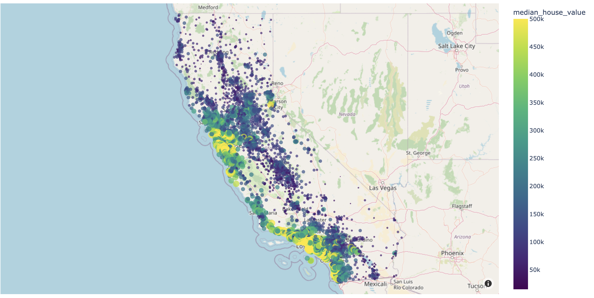

# CaliforniaHousing
The data pertains to the houses found in a given California district and some summary stats about them based on the 1990 census data.
The given dataset provides information on various attributes related to housing in different neighborhoods of California. Here is a partial description of the dataset:

- longitude: The longitude coordinates of the housing location.
- latitude: The latitude coordinates of the housing location.
- housing_median_age: The median age of houses in a specific neighborhood.
- total_rooms: The total number of rooms in a housing unit.
- total_bedrooms: The total number of bedrooms in a housing unit.
- population: The population count in a specific neighborhood.
- households: The number of households in a specific neighborhood.
- median_income: The median income of households in a specific neighborhood.
- median_house_value: The median value of houses in a specific neighborhood.
- ocean_proximity: The proximity of a housing unit to the ocean.

I aim to find a model to predict Median House Value using Random Forest Regression. 

I added the graph I created in [CaliforniaHousing.py](https://github.com/KadirOrcunAltunel/CaliforniaHousing/blob/main/CaliforniaHousing.py) below:

